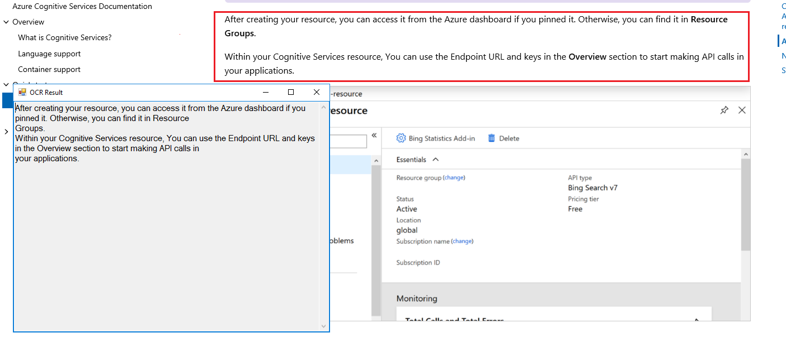
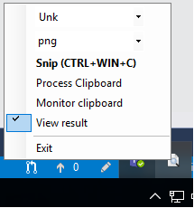

### Snipping Tool OCR
PoC of snipping tool OCR using cognitive service of Azure

### Description
For details on API cognitive services of Azure used from this tool see this [link](https://westus.dev.cognitive.microsoft.com/docs/services/56f91f2d778daf23d8ec6739/operations/56f91f2e778daf14a499e1fc) 

In *SnippingOCR.exe.config* set endpoint and key of cognitive service of Azure. 

For details see this [link](https://docs.microsoft.com/en-us/azure/cognitive-services/cognitive-services-apis-create-account)

In icon tray you can:
- Set language (default: unk)
- Set format image (default: png)
- Convert image from clipboard - Process Clipboard
- Checked to convert image automatically from clipboard - Monitor clipboard 
- Checked if see text converted - View Result. The text always is copied in clipboard
-  

